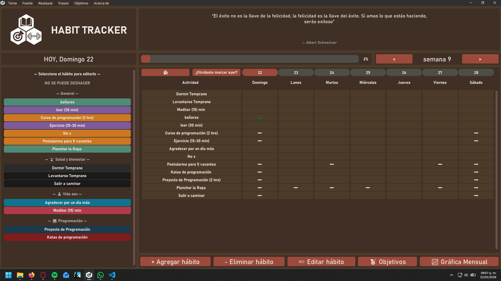
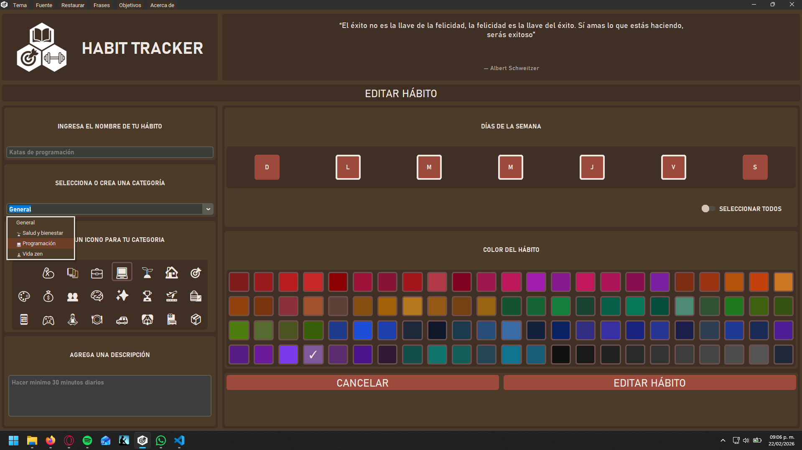
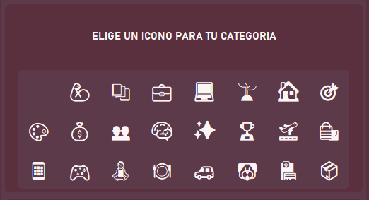
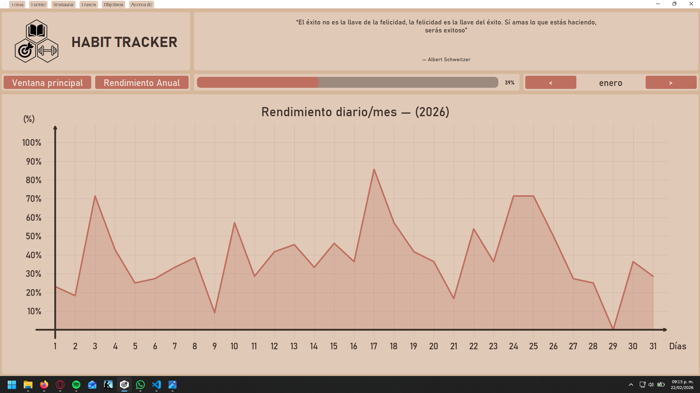
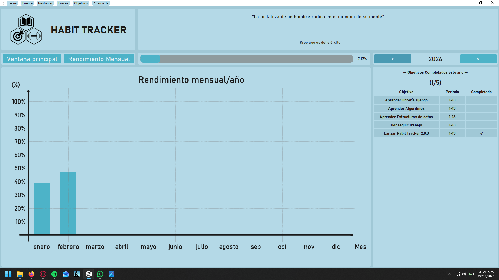
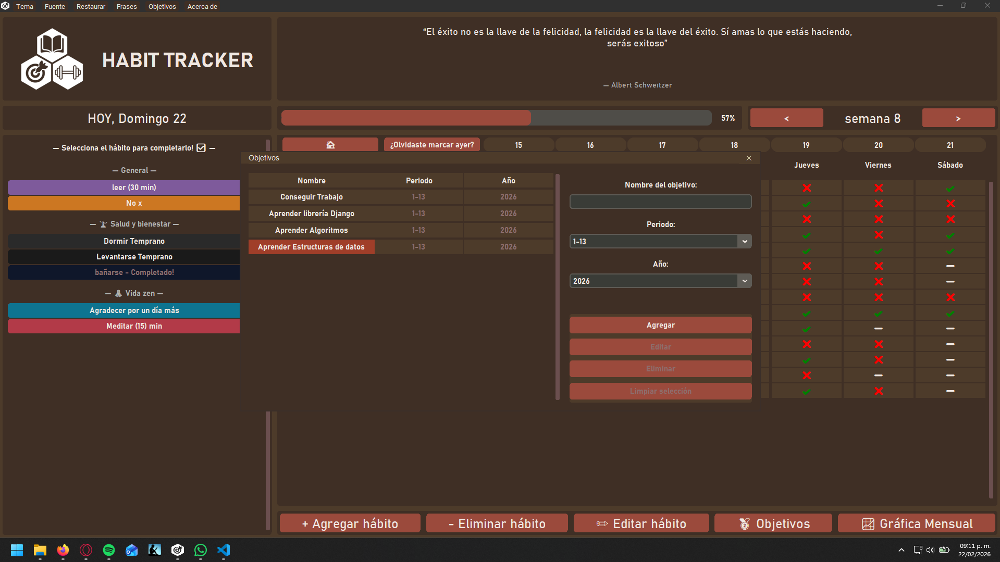
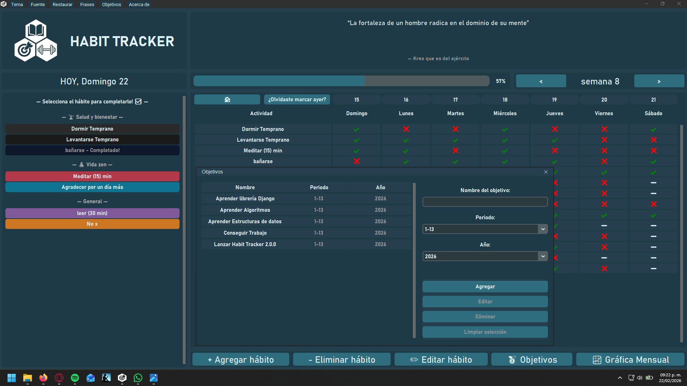
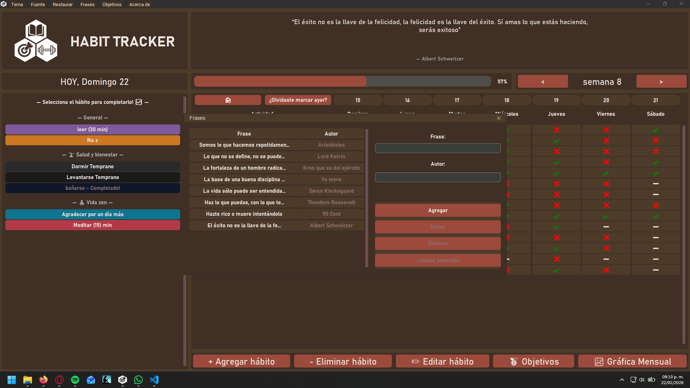
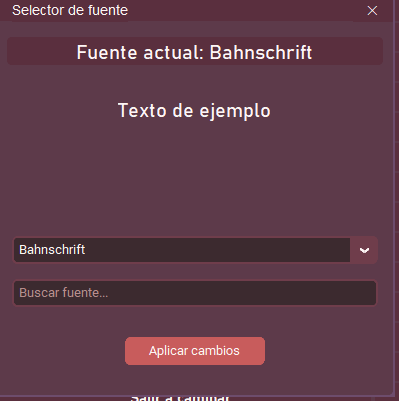
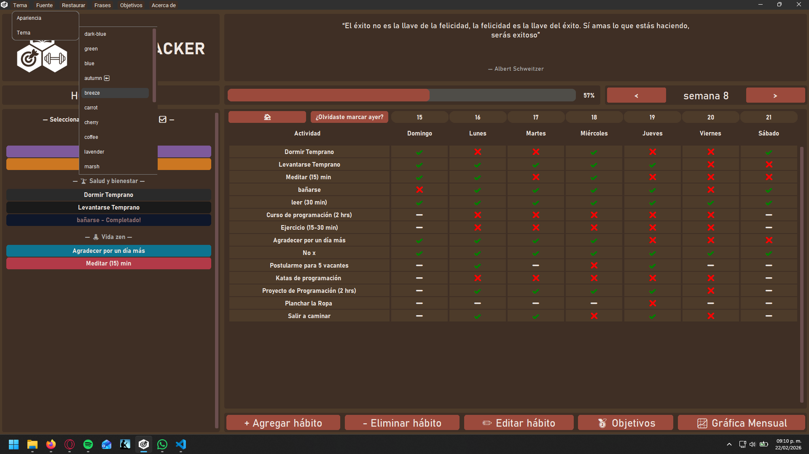

# 📌 Habit Tracker v2.0
> Robust Desktop CRUD application built with Python, emphasizing Clean Architecture and OOP principles.

[ Python | SQLite | CustomTkinter | Matplotlib]

---

## 🛠 Technical Architecture & Patterns
To ensure scalability and maintainability, the project was refactored from a script-based approach to a **Layered Architecture**:

* **Presentation Layer:** CustomTkinter for a modern, asynchronous-like GUI experience.
* **Domain Layer:** Business logic separated from UI, handling habit calculations and goal tracking.
* [cite_start]**Infrastructure Layer (Persistence):** Implemented the **Repository Pattern** with SQLite to decouple the database logic from the rest of the app. 

### Key Engineering Features:
**Data Persistence:** Migrated from JSON to **SQLite** to ensure ACID compliance and handle relational data between habits and quarterly goals.
**Performance Optimization:** Redesigned the Matplotlib integration using caching logic to prevent UI freezing during large data renders (Yearly/Monthly graphs). 
**Modular Design:** Extensive use of **Object-Oriented Programming (OOP)**, ensuring that adding new features (like the new Quotes System) doesn't break existing habit logic. 

# ✨ Key Features

## 🧱 Architecture
- Layered architecture (UI / Domain / Infrastructure)
- SQLite database with repository pattern
- Centralized logging system
- Optimized performance calculations

## ➕ Habit Management
- Add, edit and delete habits
- Category system with 23 selectable icons
- 92 selectable colors
- Improved add/edit habit window
- Switch-style completion toggle

## 🏆 Goals System (NEW in v2.0)
- Quarterly goals implemented
- Goals panel integrated in main screen
- Yearly goal tracking overview
- Full CRUD support for goals

## 📝 Quotes System
- Full CRUD support for motivational quotes
- Improved management window

## 📊 Graphs & Analytics
- Monthly graph redesigned (line chart)
- Yearly graph upgraded
- Performance significantly optimized
- Smooth navigation without UI lag

## 🎨 UI Improvements
- Fully redesigned logo and application icon
- Light/Dark mode improvements
- Theme indicator
- Font selection indicator
- Navigation redesigned (Home button added)

---

# 📷 Screenshots


## 🏠 Main Dashboard


## ➕ Add / Edit Habit


## 📂 Icons


## 📊 Monthly Graph


## 📈 Yearly Graph


## 🏆 Goals Panel


## 🗓 Quarterly Goals


## 📝 Quotes Manager


## 🎨 Theme & Font Settings


## ⚙ Settings View



---

# 🚀 Installation

## Option 1: Use the Installer (Recommended)

1. Download the latest version from the [Releases section](https://github.com/DanMG20/Habit_Tracker/releases).
2. Under **Assets**, download the installer file.
3. Run the installer and follow the instructions.

---

## Option 2: Run from Source

Clone the repository:

```bash
git clone https://github.com/DanMG20/Habit_Tracker.git
cd Habit_Tracker
